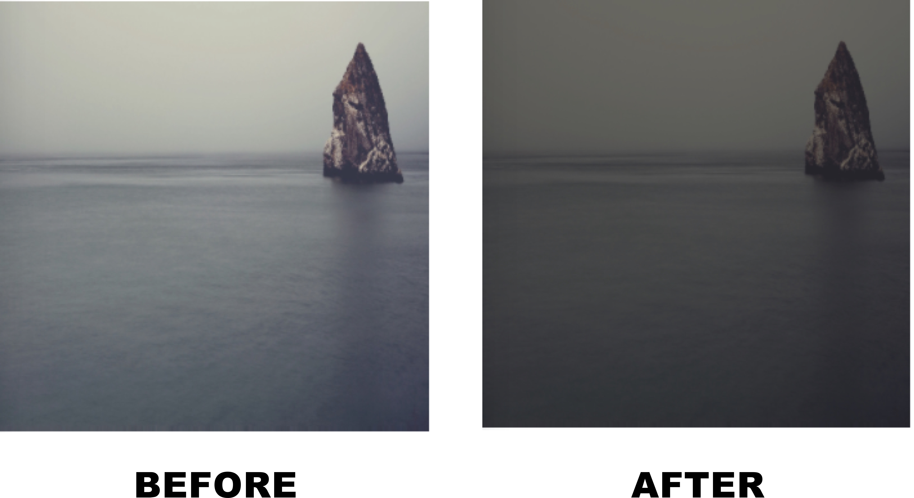

# react-imgpro

[](https://travis-ci.org/nitin42/react-imgpro)


> Image Processing Component for React

<p align="center">
  
</p>

## Introduction

`react-imgpro` is a image processing component for React. This component process an image with filters supplied as props and returns a [base64](https://en.wikipedia.org/wiki/Base64) image. 

**Example**

```jsx
class App extends React.Component {
  state = { src: '', err: null }
  
  render() {
    return (
      <ProcessImage
        image='http://365.unsplash.com/assets/paul-jarvis-9530891001e7f4ccfcef9f3d7a2afecd.jpg'
        colors={{
          mix: {
            color: 'mistyrose',
            amount: 10
          }
        }}
        resize={{ width: 500, height: 500, mode: 'bilinear' }}
        processedImage={(src, err) => this.setState({ src, err, })}
      />     
    )
  }
}
```

<p align="center">

</p>

## Motivation

<p align="center">
  
</p>

I was working on a project last month which involved a lot of image processing and I'd to rely on third party libraries. But before using them directly, I'd to learn different concepts in gl (shaders) and then try to implement them in React. The difficult part was not learning but it was the verbosity, boilerplate code and redundancy introduced by the libraries in the codebase. It was getting difficult to organise all the things 😞

So I wanted a layer of abstraction which would make it easy to manipulate the colors of the image, applying filters and gl shaders efficiently with ease. And React's component based model was perfect for hiding all the implementation details in a component 😄 

## Demo

<p align="center">
  
</p>

## Install

```
npm install react-imgpro
```

This also depends on `react` so make sure you've installed it.

OR

The UMD build is also available via [jsDelivr](https://www.jsdelivr.com).

```
<script src="https://cdn.jsdelivr.net/npm/react@16/umd/react.production.min.js"></script>
<script src="https://cdn.jsdelivr.net/npm/react-imgpro@1/build/main.js"></script>
```

## Usage

```jsx
import React from 'react';
import ProcessImage from 'react-imgpro';

class App extends React.Component {
  state = {
    src: '',
    err: null
  }
  
  render() {
    return (
      <ProcessImage
        image='http://365.unsplash.com/assets/paul-jarvis-9530891001e7f4ccfcef9f3d7a2afecd.jpg'
        resize={{ width: 500, height: 500 }}
        colors={{
          mix: {
            color: 'mistyrose',
            amount: 20
          }
        }}
        processedImage={(src, err) => this.setState({ src, err})}
      />
    )
  }
}

```

## Documentation

See the detailed documentation [here](./Docs).

## SSR support ?

Yes, `react-imgpro` supports SSR.

## Contributing

[Contributing guide](https://github.com/nitin42/react-imgpro/blob/master/Docs/CONTRIBUTING.MD).

## Extra resources

If you want to use blenders, plugins and perform event based calculations, try [CamanJS](http://camanjs.com/).

## License

MIT

<a href="https://app.codesponsor.io/link/FCRW65HPiwhNtebDx2tTc53E/nitin42/react-imgpro" rel="nofollow"></a>
